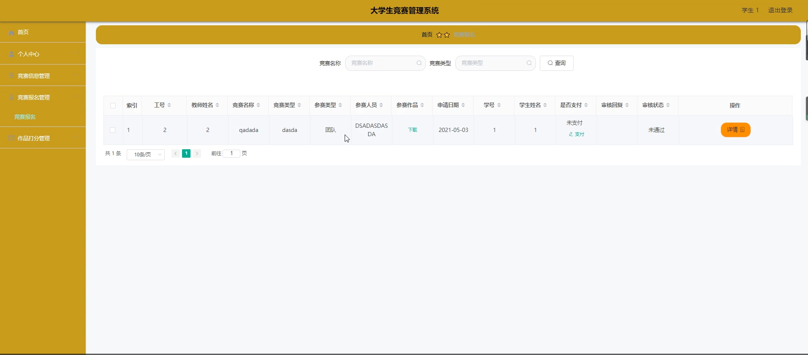

# 基于springboot的大学生竞赛管理系统

---
### 👉作者QQ ：1556708905 微信：zheng0123Long (支持定制修改、部署调试、定制毕设)

### 👉接网站建设、小程序、H5、APP、各种系统等

---

#### 介绍

在当今高度重视创新和实践能力培养的教育环境下，大学生竞赛成为了提升学生综合素质和竞争力的重要途径。为了更高效地组织和管理各类竞赛活动，本基于 Spring Boot 的大学生竞赛管理系统应运而生。该系统旨在为高校提供一个集成化、规范化和智能化的竞赛管理平台，促进竞赛活动的顺利开展和学生创新能力的培养。

#### 技术栈

后端技术栈：Springboot+Mysql+Maven

前端技术栈：Vue+Html+Css+Javascript+ElementUI

开发工具：Idea+Vscode+Navicate

#### 系统功能介绍

（一）管理端  
个人中心：管理端人员可以查看和修改个人信息，接收系统通知和重要消息。  
学生管理：对学生的基本信息、参赛记录等进行全面管理，包括学生信息的录入、修改、查询和统计。  
教师管理：负责教师的信息登记、权限设置、教学任务安排以及工作绩效评估等。  
竞赛信息管理：发布和更新各类竞赛的详细信息，如竞赛名称、主题、规则、时间安排、奖项设置等。  
竞赛报名管理：审核学生和教师的竞赛报名申请，对报名信息进行统计和分析。  
班级类型管理：对不同专业、年级的班级进行分类管理，以便更好地组织竞赛和统计参赛情况。  

（二）教师端  
个人中心：教师可以查看和编辑个人资料，设置教学偏好和通知提醒方式。  
竞赛信息管理：查阅学校发布的各类竞赛信息，了解竞赛的具体要求和流程。  
竞赛报名管理：审核学生的报名申请，指导学生组队和报名。  
作品打分管理：对学生提交的竞赛作品进行评分和评价，给出专业的反馈和建议。  

（三）学生端  
个人中心：学生能够修改个人信息，查看参赛历史和成绩记录。  
竞赛信息管理：获取最新的竞赛资讯，了解竞赛的详细内容和要求。  
竞赛报名管理：在线提交竞赛报名申请，选择参赛项目和组队成员。  
作品打分管理：查看教师对自己作品的打分和评价，了解自身的优势和不足。  
  
#### 系统作用

提高竞赛管理效率  
自动化的报名审核和信息管理流程，减少了人工操作的繁琐和错误，提高了工作效率。  
实时的数据统计和分析功能，为管理者提供了决策依据，有助于合理安排资源和优化竞赛组织。  
促进竞赛公平公正  
规范的报名流程和审核机制，确保了参赛学生和团队的资格符合要求，保证了竞赛的公平性。  
教师对作品的打分管理采用标准化的评价体系，减少了主观因素的影响，使竞赛结果更加公正。  
提升学生参与度和创新能力  
便捷的竞赛信息获取渠道和报名方式，鼓励更多学生参与竞赛，激发学生的创新热情和实践能力。  
教师的指导和评价有助于学生在竞赛中不断改进和提高，培养学生的团队协作和解决问题的能力。  
加强师生互动与合作  
系统为师生提供了一个交流和合作的平台，促进了师生之间的知识分享和经验传承。  
教师在竞赛指导过程中能够更好地了解学生的需求和特长，为教学改革提供参考。  

#### 系统功能截图

代码结构

数据库表

登录

教师端个人信息

竞赛信息管理

作品打分管理

学生端竞赛信息

竞赛报名管理

管理员端学生管理

教师信息管理

班级类型

#### 总结

本基于 Spring Boot 的大学生竞赛管理系统，通过科学合理的角色分工和功能模块设计，实现了对大学生竞赛活动的全流程管理和服务。它不仅提升了竞赛管理的水平和效率，也为学生的创新实践提供了有力支持，对于推动高校创新创业教育的发展具有重要意义。在未来的应用中，系统将不断完善和优化，以适应日益变化的教育需求和竞赛环境，为培养更多高素质的创新人才发挥更大的作用。

#### 使用说明

创建数据库，执行数据库脚本 修改jdbc数据库连接参数 下载安装maven依赖jar 启动idea中的springboot项目

后台地址：http://localhost:8080/springbootrd362/admin/dist/index.html

管理员  abo 密码 abo

